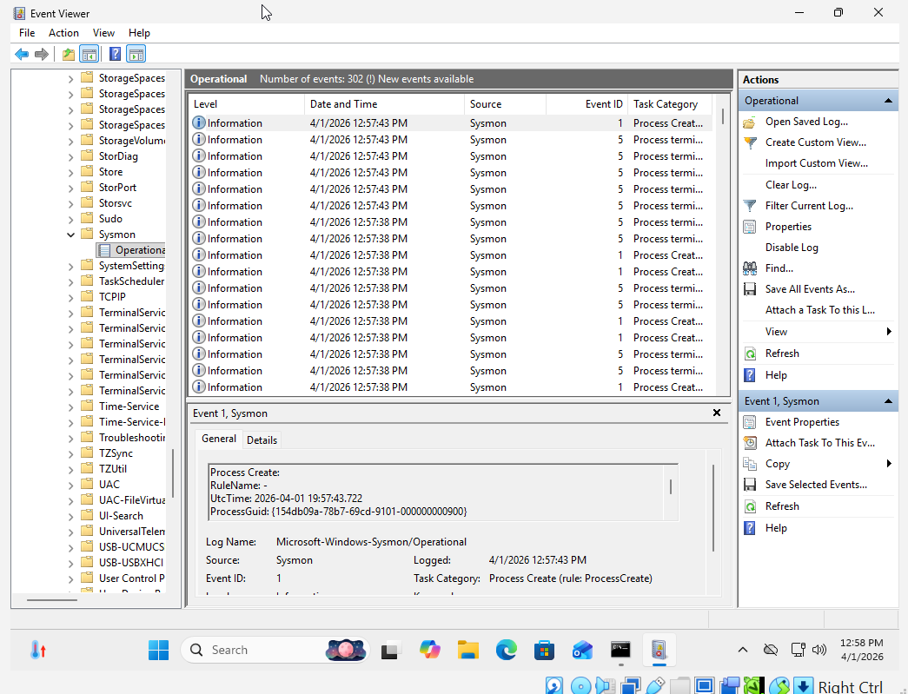

# 🛡️ Sysmon Log Analysis Project

## 📌 Overview
Configured Sysmon on a Windows virtual machine to capture detailed system activity and analyze logs generated from user actions.

## 🖥️ Lab Setup
- **Virtualization:** VirtualBox  
- **Attacker Machine:** Kali Linux  
- **Target Machine:** Windows 11  
- **Tool:** Sysmon  

## 🎯 Objective
Capture and analyze endpoint activity logs to understand how system behavior is recorded and monitored.

## 🔍 Activity Performed

### Sysmon Installation
Installed Sysmon to enhance Windows logging capabilities and capture detailed telemetry.

### Simulated Activity
Executed commands on the Windows system:

`whoami`  
`ipconfig`  
`tasklist`  
`net user`  

## 📸 Evidence

## 🧠 Analysis
Sysmon Event ID 1 logs captured process creation activity generated by user commands. Each event provided detailed information including the process name, command line arguments, and executing user.

This demonstrates how endpoint monitoring tools can track system activity and provide visibility into potentially suspicious behavior.

## 🚀 Skills Demonstrated
- Endpoint monitoring with Sysmon  
- Log analysis using Event Viewer  
- Process activity tracking  
- Understanding Windows event logging  

## 🔮 Future Improvements
- Apply custom Sysmon configuration (SwiftOnSecurity config)  
- Forward logs to SIEM (Splunk)  
- Create detection rules for suspicious behavior  
